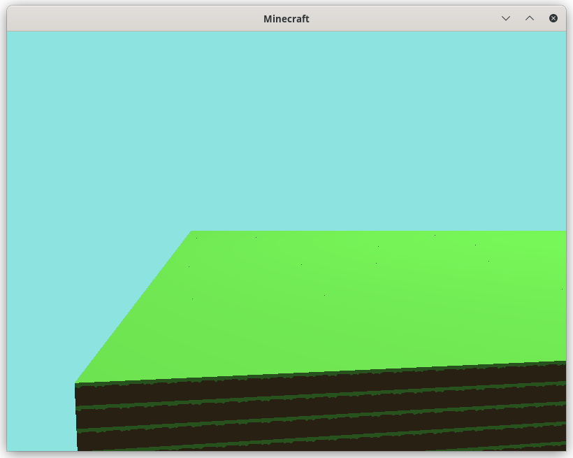
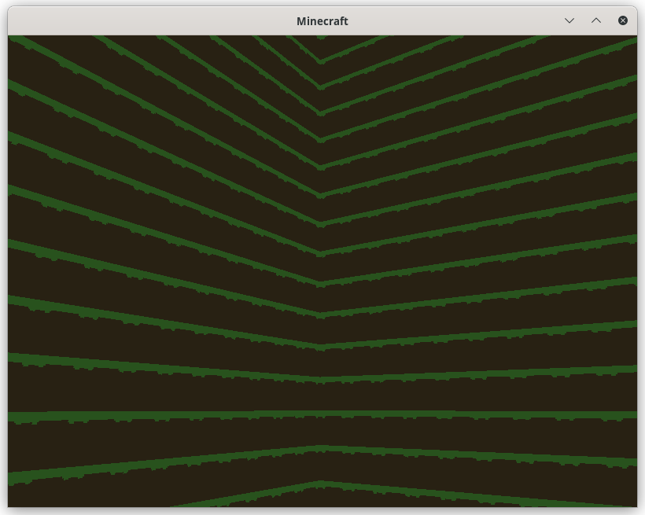
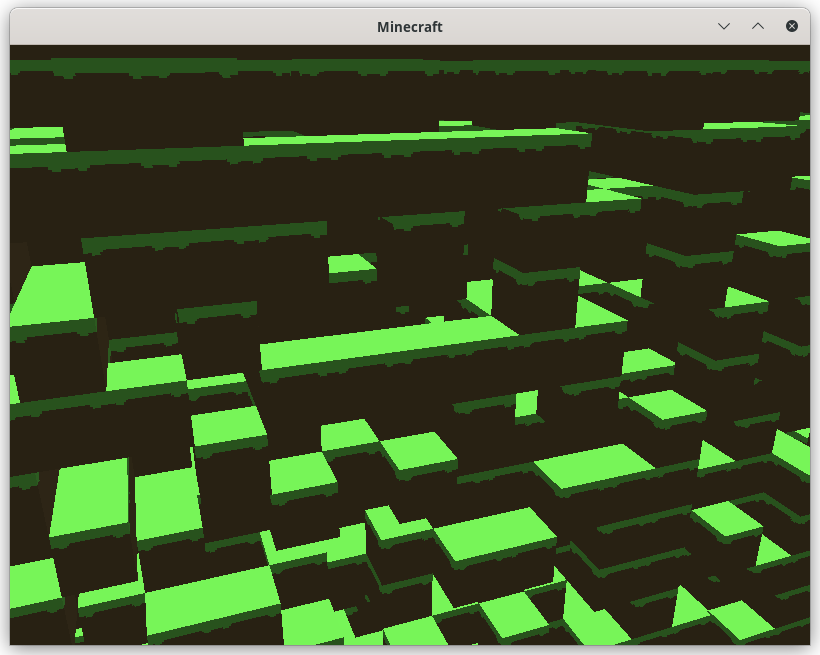

# 介绍
这是一个开源的我的世界实现，目前完成了区块生成，相机移动。




# 运行
```
git clone https://github.com/yangyagami/minecraftClone.git
cd minecraftClone 
cd build
cmake ..
make
./minecraft
```

# 后续实现功能
* 地形生成
* 物理系统
* 区块加载
* UI
